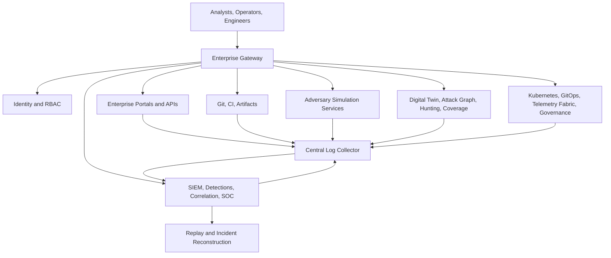

# Shield-PDP Enterprise Cyber Range

Shield-PDP is an internal, isolated-lab enterprise cyber range for security engineering, red-team simulation, purple-team exercises, SOC training, threat hunting, telemetry engineering, and distributed infrastructure operations.

This project started as a vulnerable API lab. It is now a staged enterprise simulation ecosystem with identity, internal services, CI/CD, secrets, SIEM, detections, replay, adversary-operation simulation, digital twin activity, attack graph intelligence, governance, Kubernetes deployment artifacts, GitOps structure, and distributed observability.

> Safety scope: Shield-PDP is synthetic, educational, observable, replayable, controllable, and non-destructive. It must not be connected to public targets or used to build malware, ransomware, destructive persistence, or uncontrolled offensive automation.

## Security Notice

This is a controlled lab project. Do not commit `.env` files, local API keys, JWT secrets, database passwords, private keys, or runtime tokens. Use `.env.example` and `apps/web/.env.local.example` as placeholders, rotate any exposed local API keys before publishing, and keep vulnerable endpoints restricted to educational validation inside the lab.

## Contents

- [Security Notice](#security-notice)
- [What Shield-PDP Provides](#what-shield-pdp-provides)
- [Architecture Summary](#architecture-summary)
- [Stage Progression](#stage-progression)
- [Quick Start](#quick-start)
- [Validation Guide](#validation-guide)
- [Primary URLs](#primary-urls)
- [Dana Sejahtera Shield Frontend](#dana-sejahtera-shield-frontend)
- [Shield-PDP Fintech BurpSuite Demo](#shield-pdp-fintech-burpsuite-demo)
- [Documentation Portal](#documentation-portal)
- [Screenshots](#screenshots)
- [Operational Notes](#operational-notes)
- [Safety And Ethics](#safety-and-ethics)

## What Shield-PDP Provides

| Capability | Description |
| --- | --- |
| Enterprise infrastructure simulation | Gateway, internal services, identity, RBAC, service accounts, trust zones, and Docker networks. |
| Vulnerable enterprise ecosystem | Realistic SSRF, token, CI/CD, service trust, metadata, and secrets simulations for defensive training. |
| Detection engineering lab | Sigma-style rules, SIEM bridge, Wazuh/OpenSearch-compatible alert shapes, alert validation, and SOC workflows. |
| Purple-team replay | Reconstruct attack timelines, replay controlled scenarios, and validate detection coverage. |
| Controlled adversary operations | Safe beacon, redirector, pivot, persistence, and campaign simulation with explicit safety controls. |
| Digital twin and threat hunting | Synthetic enterprise activity, attack graph intelligence, autonomous campaign orchestration, chaos simulation, hunting workflows, and executive reporting. |
| Productionization layer | Kubernetes manifests, Helm chart, GitOps manifests, distributed telemetry configs, governance, zero-trust simulation, and HA workflows. |

## Architecture Summary



## Stage Progression

| Stage | Layer | Primary Outcome |
| --- | --- | --- |
| Stage 1 | Enterprise foundation | Gateway, RBAC, internal service model, and architecture baseline. |
| Stage 2 | Core enterprise infrastructure | Auth service, internal portals, centralized logs, observability, health checks. |
| Stage 3 | Vulnerable enterprise ecosystem | Identity attack paths, internal trust abuse, CI/CD simulation, secrets exposure. |
| Stage 4 | Detection and purple team | SIEM pipeline, Sigma-style rules, correlation engine, SOC dashboard, replay. |
| Stage 5 | Controlled adversary operations | Safe beacon, pivot, redirector, persistence, campaign, OPSEC simulation. |
| Stage 6 | Intelligence and digital twin | Enterprise activity simulation, attack graph, hunting, coverage, chaos, executive views. |
| Stage 7 | Productionization and scale | Kubernetes, Helm, GitOps, telemetry fabric, governance, zero trust, HA simulation. |

## Quick Start

Basic demo stack:

```bash
make up
make validate
```

Full enterprise cyber range overlay:

```bash
make stage7-up
make stage7-validate
```

Inspect running services:

```bash
make stage7-ps
```

## Validation Guide

Run validations from lowest to highest stage when checking compatibility:

```bash
make validate
make stage2-validate
make stage3-validate
make stage4-validate
make stage5-validate
make stage6-validate
make stage7-validate
```

Each validator checks routes, auth, telemetry, detections, replay integrity, service health, and stage-specific workflows.

## Primary URLs

| URL | Purpose |
| --- | --- |
| `http://localhost:3000` | Original dashboard and vulnerable API gateway. |
| `http://localhost:3000/api/v1/vulnerable/docs` | FastAPI vulnerable lab API docs. |
| `http://localhost:3000/api/v1/secure/...` | Secure comparison API namespace for ownership-enforced controls. |
| `http://localhost:3000/api/v1/pentest/findings` | Finding-shaped PostgreSQL-backed evidence API. |
| `http://localhost:3200/login` | Dana Sejahtera Shield fintech frontend in local Next.js dev mode. |
| `http://localhost:3100` | Enterprise gateway root and route inventory. |
| `http://localhost:3100/identity/` | Identity and OAuth simulation. |
| `http://localhost:3100/purple/` | SOC and purple-team dashboard. |
| `http://localhost:3100/ops/` | Controlled adversary operations simulation. |
| `http://localhost:3100/intelligence/` | Stage 6 intelligence dashboard. |
| `http://localhost:3100/scale/` | Stage 7 enterprise-scale operations dashboard. |

## Dana Sejahtera Shield Frontend

The production-style fintech, privacy, compliance, and pentest portal lives in `apps/web`.

Run it locally:

```bash
cd apps/web
npm install
npm run dev
```

Open `http://localhost:3200`. The dev and start scripts bind to `0.0.0.0`, so a separate Kali or evaluator machine on the same network can open `http://<ubuntu-host-ip>:3200/login`.

Direct Kali LAN access:

```bash
make web-dev-lan
```

By default this runs the frontend with `NEXT_PUBLIC_SHIELD_API_BASE_URL=http://192.168.18.205:3000`. To use a different VM address:

```bash
make web-dev-lan WEB_HOST=<shield-cloud-lan-ip>
```

Then open `http://192.168.18.205:3200/login` from Kali. Browser API calls go directly to `http://192.168.18.205:3000` and remain interceptable in BurpSuite.

Production check:

```bash
cd apps/web
npm run typecheck
npm run lint
npm run build
```

Optional browser smoke tests:

```bash
cd apps/web
npx playwright install chromium
npm run test:e2e
```

On minimal Linux hosts, Playwright may also require system browser libraries:

```bash
cd apps/web
sudo npx playwright install-deps chromium
```

Implemented route groups:

| Area | Routes |
| --- | --- |
| Auth and onboarding | `/login`, `/register`, `/onboarding` |
| Customer fintech portal | `/dashboard`, `/accounts`, `/transactions`, `/transfer`, `/profile/privacy`, `/security` |
| Compliance | `/compliance`, `/compliance/gap-analysis`, `/compliance/breach-notification` |
| Pentest workspace | `/pentest`, `/pentest/findings`, `/pentest/bola`, `/pentest/segmentation` |
| Executive and reports | `/executive`, `/reports` |
| Admin operations | `/admin`, `/admin/audit-logs`, `/admin/incidents` |

The frontend uses Next.js App Router, TypeScript, Tailwind CSS, lucide-react, recharts, Playwright smoke tests, and shadcn/ui-style local component primitives. It includes demo role switching for Customer, Admin, Auditor, and Pentester personas.

Data mode:

- In connected demo mode, set the gateway root with `NEXT_PUBLIC_SHIELD_API_BASE_URL=http://localhost:3000`.
- For direct Kali LAN access, set `NEXT_PUBLIC_SHIELD_API_BASE_URL=http://192.168.18.205:3000` or run `make web-dev-lan`.
- When a backend URL is configured, the UI calls the real backend and shows backend errors instead of silently falling back to mock data.
- If no backend URL is configured, the UI may use synthetic mock data from `apps/web/lib/api/mock.ts` and displays `Mock adapter`.
- `apps/web/.env.local` is set to the local gateway root for the BurpSuite demo:

```bash
cd apps/web
NEXT_PUBLIC_SHIELD_API_BASE_URL=http://localhost:3000 npm run dev
```

- Frontend login calls `POST /api/v1/vulnerable/login` with `application/x-www-form-urlencoded` data, stores the demo token in browser localStorage, and sends `Authorization: Bearer <access_token>` on authenticated API calls.
- BurpSuite can intercept and edit browser requests such as `GET /api/v1/vulnerable/accounts/ACC-BUDI-001`, `GET /api/v1/vulnerable/transactions/TRX-BUDI-001`, and `POST /api/v1/vulnerable/transfers`.
- Existing compatible lab routes are normalized where possible: `/health`, `/ready`, `/dashboard/summary`, `/me/accounts`, `/me/profile`, `/admin/users`, `/audit/events`, and the new PostgreSQL-backed fintech routes.

Demo roles:

| Role | Best starting route | What it demonstrates |
| --- | --- | --- |
| Customer | `/dashboard` | Wallet balance, transactions, masked NIK/account data, consent, security posture, suspicious activity. |
| Admin | `/admin` | Operations monitoring, customer overview, failed logins, suspicious API calls, incident queue, audit logs. |
| Auditor | `/compliance` | UU PDP evidence for PDP-01 encryption, PDP-02 access control and audit logging, PDP-03 breach notification readiness. |
| Pentester | `/pentest` | Rules of Engagement, CVSS findings, BOLA evidence, segmentation validation, safe proof-of-concept wording. |

Suggested live demo script:

1. Open `/login`, show the four demo roles, and explain that the application is a synthetic fintech portal for PT. Dana Sejahtera.
2. Select Customer and open `/dashboard`; show wallet activity, suspicious transaction context, and masked sensitive data in `/profile/privacy`.
3. Switch to Admin and open `/admin`; show operations metrics, system health, incidents, and `/admin/audit-logs`.
4. Switch to Auditor and open `/compliance`; walk through PDP-01, PDP-02, PDP-03, then open `/compliance/gap-analysis` and `/compliance/breach-notification`.
5. Switch to Pentester and open `/pentest`; show RoE, `/pentest/findings`, `/pentest/bola`, and `/pentest/segmentation`.
6. Close with `/executive` and `/reports` to show business risk, remediation progress, and deliverable packages.

Recommended evaluator flow:

| Step | Route | Evaluation focus |
| --- | --- | --- |
| 1 | `/login` | Role switching, security notice, MFA placeholder, demo scope. |
| 2 | `/dashboard` | Fintech realism and customer trust UX. |
| 3 | `/profile/privacy` | Masking, reveal warning, audit preview, data classification. |
| 4 | `/compliance` | PDP control visibility and evidence readiness. |
| 5 | `/pentest/findings` | Safe findings, CVSS, PDP impact, remediation clarity. |
| 6 | `/admin/audit-logs` | Auditability and role-scoped operational visibility. |
| 7 | `/reports` | Professional deliverable center and export guardrails. |

### Backend Integration And Pentest Automation

Start the backend stack first:

```bash
make up
```

Run the frontend in connected mode:

```bash
cd apps/web
NEXT_PUBLIC_SHIELD_API_BASE_URL=http://localhost:3000 npm run dev
```

Run the safe IDOR/RBAC/segmentation validation flow:

```bash
make redteam-sim
```

The script logs in as Budi, demonstrates vulnerable account/transaction/transfer IDOR, confirms secure routes return 403, checks customer admin denial, requests segmentation evidence, then logs in as admin to fetch audit events and pentest evidence. It writes:

- `reports/pentest/redteam_validation.json`

Additional HTTP contract validation:

```bash
python3 scripts/automation/overnight_contract_test.py
python3 scripts/automation/smoke_test.py
```

The automation redacts JWTs and refresh tokens, uses only synthetic users/accounts/transactions, does not move balances, does not send destructive payloads, and does not target anything outside the configured Shield-PDP backend URL.

## Shield-PDP Fintech BurpSuite Demo

The current fintech demo is documented in:

- [Shield-PDP Demo Guide](docs/SHIELD_PDP_DEMO_GUIDE.md)
- [BurpSuite Manual Testing](docs/BURPSUITE_MANUAL_TESTING.md)
- [Overnight Implementation Report](docs/OVERNIGHT_IMPLEMENTATION_REPORT.md)

Remote PostgreSQL is expected on shield-db over Tailscale at `100.110.198.103:5432`, with the backend on shield-cloud reading connection settings from `/opt/shield/secrets/database.env`. Do not place database secrets in the repository and do not expose PostgreSQL publicly.

### Direct Kali LAN Access

1. SSH is only needed for administration:

```bash
ssh ubuntu@192.168.18.205
```

2. On shield-cloud, confirm the backend/proxy:

```bash
docker compose ps api-vulnerable proxy
curl http://localhost:3000/api/v1/vulnerable/ready
```

3. Run the frontend for LAN access:

```bash
make web-dev-lan
```

Equivalent manual command:

```bash
cd apps/web
NEXT_PUBLIC_SHIELD_API_BASE_URL=http://192.168.18.205:3000 npm run dev
```

4. From Kali, open:

```text
http://192.168.18.205:3200/login
```

5. In BurpSuite, use the Kali browser proxy `127.0.0.1:8080`.

Expected browser requests:

- `POST http://192.168.18.205:3000/api/v1/vulnerable/login`
- `GET http://192.168.18.205:3000/api/v1/vulnerable/accounts/ACC-BUDI-001`
- `GET http://192.168.18.205:3000/api/v1/vulnerable/transactions/TRX-BUDI-001`
- `POST http://192.168.18.205:3000/api/v1/vulnerable/transfers`

Manual Burp modifications:

- `ACC-BUDI-001` -> `ACC-MAYA-001`
- `TRX-BUDI-001` -> `TRX-MAYA-001`
- `sourceAccountId` -> `ACC-MAYA-001`

## Documentation Portal

Start with [docs/README.md](docs/README.md).

Key guides:
- [Getting Started](docs/getting-started/README.md)
- [Enterprise Architecture](docs/architecture/enterprise_topology.md)
- [Attack Chain Walkthroughs](docs/attack-chains/README.md)
- [SOC Analyst Guide](docs/playbooks/soc_analyst_guide.md)
- [Red Team Operator Guide](docs/playbooks/red_team_operator_guide.md)
- [Threat Hunting Guide](docs/hunt/threat_hunting_guide.md)
- [Operations Guide](docs/operations/operations_guide.md)
- [API Reference](docs/api/api_reference.md)

## Screenshots

The repository is CLI-first. Recommended screenshots for an internal wiki export:

| Screenshot | Capture Target |
| --- | --- |
| Enterprise route inventory | `http://localhost:3100` |
| SOC incident view | `http://localhost:3100/purple/` |
| Intelligence dashboard | `http://localhost:3100/intelligence/` |
| Enterprise scale dashboard | `http://localhost:3100/scale/` |
| Service status | Output from `make stage7-ps` |

## Operational Notes

- Compose is the authoritative local lab runtime.
- Kubernetes, Helm, and GitOps artifacts model distributed deployment but are intentionally safe templates.
- All simulations emit structured telemetry with request IDs and stage tags.
- Stage 7 validates 38 health targets when the full overlay is running.
- Lab credentials and secrets are demo-only and must not be reused outside an isolated lab.

## Safety And Ethics

Shield-PDP documentation and code are written for internal defensive training, cyber range operations, and research. The platform intentionally avoids real malware behavior, ransomware, destructive actions, uncontrolled persistence, public exploitation guidance, and public attack infrastructure.
