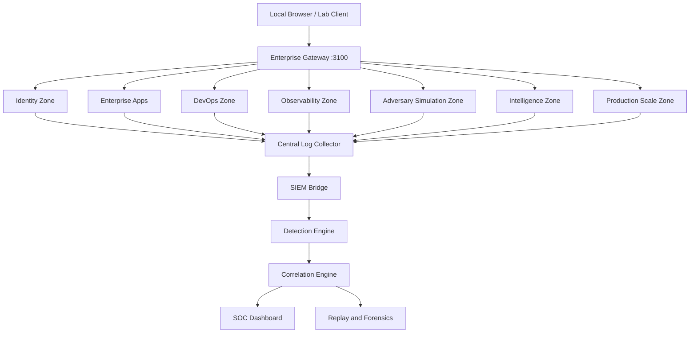

# Enterprise Topology

Shield-PDP models a modern enterprise with segmented zones, identity-centric trust, centralized telemetry, controlled adversary simulation, and production-scale infrastructure operations.

## Logical Topology

## Zones

| Zone | Services | Training Purpose |
| --- | --- | --- |
| Edge | `enterprise-gateway`, base `proxy` | North-south routing, auth middleware, request IDs. |
| Identity | `auth-service`, `vault-sim`, `secrets-broker` | OAuth/JWT, service accounts, RBAC, secrets lifecycle. |
| Enterprise | Employee, HR, Finance, Admin, Developer, Internal API, Discovery | Realistic internal workflows and trust boundaries. |
| DevOps | `git-sim`, `ci-sim`, `artifact-store` | CI/CD trust, artifact provenance, pipeline governance. |
| Observability | `log-collector`, `observability-api`, `siem-bridge`, `detection-engine`, `correlation-engine`, `soc-dashboard` | Telemetry, alerts, triage, replay, SIEM compatibility. |
| Adversary Operations | `adversary-control`, `beacon-sim`, `redirector-sim`, `pivot-sim`, `persistence-sim` | Controlled and observable red-team simulation. |
| Intelligence | `digital-twin`, `attack-graph`, `campaign-orchestrator`, `threat-hunting`, `coverage-intel`, `chaos-sim`, `intelligence-dashboard` | Digital twin, attack graph, hunt, coverage, chaos, executive reporting. |
| Production Scale | `kubernetes-orchestrator`, `gitops-controller`, `telemetry-fabric`, `resilience-hub`, `environment-manager`, `zero-trust-mesh`, `governance-engine`, `delivery-governance`, `scale-dashboard` | Kubernetes, GitOps, HA, governance, zero trust, distributed telemetry. |

## Design Principles

- Preserve compatibility between stages.
- Add new capability through overlays.
- Keep simulations synthetic and reversible.
- Emit structured telemetry for every workflow.
- Keep attack paths realistic but safe.
- Support both operator workflows and SOC visibility.

## Docx Export Notes

This page is suitable as the "Enterprise Topology" section of a handbook. Keep the Mermaid diagram near the beginning, followed by the zone table.
