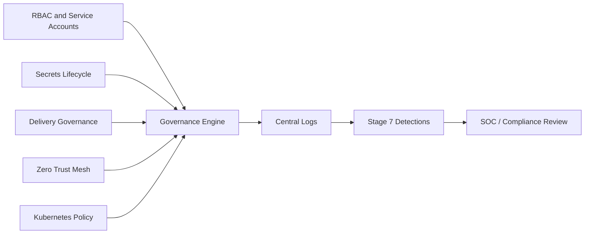

# Governance Architecture

Governance in Shield-PDP is operational, not decorative. It connects RBAC, secrets lifecycle, policy drift, deployment approvals, integrity validation, and compliance scoring.

## Governance Flow

## Governance Domains

| Domain | Examples |
| --- | --- |
| Identity | Role assignments, service-account scopes, least privilege. |
| Secrets | Rotation simulation, lifecycle tracking, no secret material generation. |
| Kubernetes | Namespace quotas, network policies, deployment probes. |
| Delivery | Artifact verification, dependency scan simulation, approval gates. |
| Zero Trust | mTLS posture, service identity, policy decisions. |
| Audit | Evidence export, drift detection, compliance score. |

## Operational Use

Use governance docs and APIs during:
- platform readiness reviews
- executive tabletop exercises
- SOC audit evidence training
- GitOps approval walkthroughs
- policy drift investigations
