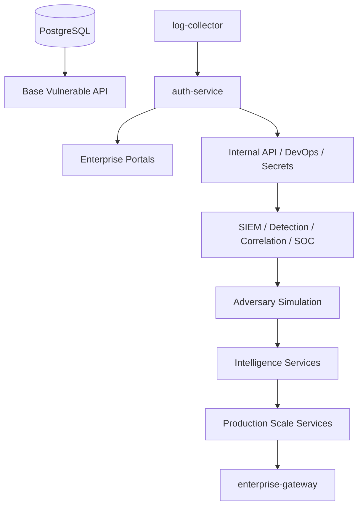

# Service Dependencies

This document describes the runtime dependency model for enterprise overlays.

## Core Dependency Chain

## Stage 7 Dependencies

| Service | Depends On | Purpose |
| --- | --- | --- |
| `kubernetes-orchestrator` | Auth, logs, observability | Manifest, namespace, HPA, quota validation. |
| `gitops-controller` | Kubernetes orchestrator, CI | Rollout, Helm, rollback simulation. |
| `telemetry-fabric` | Detection, correlation | Distributed trace and telemetry SLA simulation. |
| `resilience-hub` | Telemetry fabric | HA, failover, recovery verification. |
| `environment-manager` | Attack graph | Multi-region and tenant topology modeling. |
| `zero-trust-mesh` | Environment manager | mTLS and service policy simulation. |
| `governance-engine` | Zero-trust mesh | Policy, compliance, drift, secrets lifecycle. |
| `delivery-governance` | GitOps, governance, artifact store | Artifact verification, scan, approval, policy checks. |
| `scale-dashboard` | All Stage 7 services | Executive and platform operations view. |

## Health Model

Every enterprise service exposes:
- `/health`
- `/ready`
- `/metrics`

The observability API aggregates configured stage targets. Stage 7 expects 38 healthy targets in the full overlay.
