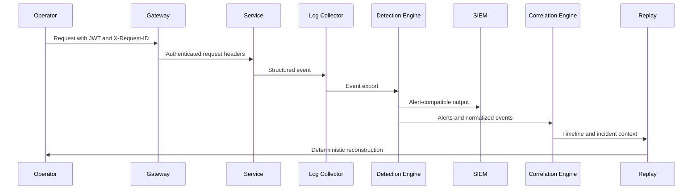

# Telemetry, Detection, And Replay Pipeline

Shield-PDP treats telemetry as the shared source of truth for SOC triage, detection validation, replay, and executive reporting.

## Pipeline

## Event Requirements

| Field | Purpose |
| --- | --- |
| `event` | Detection match and timeline identity. |
| `event_id` | Stable alert correlation. |
| `request_id` | Cross-service trace correlation. |
| `principal` | Identity and service-account attribution. |
| `lab_stage` | Stage-specific scoping. |
| `severity` | Alert and incident prioritization. |
| `mitre` | ATT&CK mapping. |
| `controls` | Safety and simulation constraints. |

## Detection Rule Sources

| Stage | Rule File |
| --- | --- |
| Stage 4 | `detections/sigma/stage4_enterprise_lab_rules.yml` |
| Stage 5 | `detections/sigma/stage5_adversary_operations_rules.yml` |
| Stage 6 | `detections/sigma/stage6_intelligence_digital_twin_rules.yml` |
| Stage 7 | `detections/sigma/stage7_production_scale_rules.yml` |

## Replay Integrity

Replay workflows must preserve:
- original event order
- request IDs
- detection rule IDs
- attack or simulation stage
- synthetic safety metadata
- graph or infrastructure state summaries
