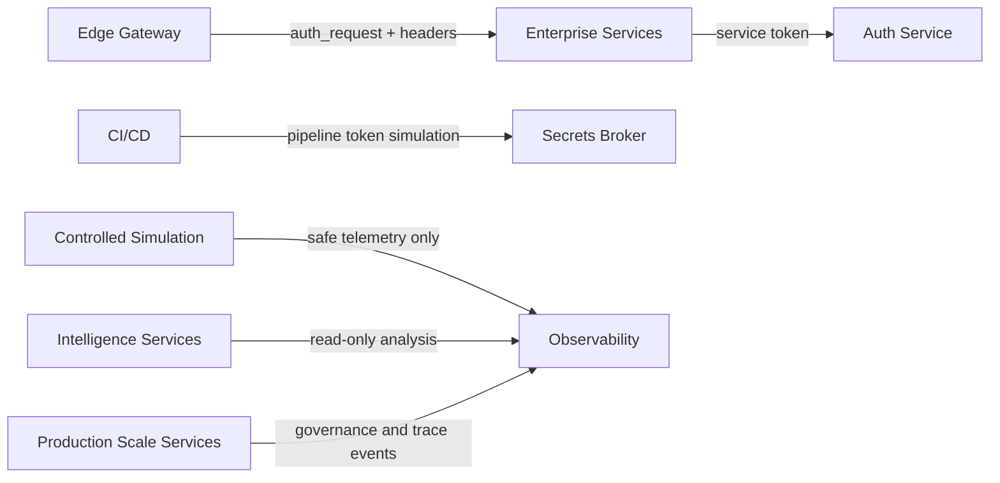

# Trust Boundaries

Shield-PDP is identity-centric. Most scenarios teach how trust relationships affect detection, investigation, and architecture risk.

## Boundary Model

## Primary Boundaries

| Boundary | Control | Simulation Risk |
| --- | --- | --- |
| Client to gateway | JWT auth, rate limit, request tracing | Auth confusion, missing token, route exposure. |
| Gateway to service | Auth headers, role checks | Over-trusting gateway identity headers. |
| Service to identity | Service account token | Service account misuse or stale token acceptance. |
| DevOps to secrets | Pipeline token and policy simulation | Leaked token, legacy policy trust, artifact environment leakage. |
| Red team to SOC | Telemetry-only simulation | Detection bypass simulation without destructive behavior. |
| Intelligence to observability | Read-only event export | Blind spots, replay gaps, attack graph drift. |
| Platform to governance | Policy and evidence events | Drift, weak approvals, missing quotas, zero-trust policy violations. |

## Boundary Review Checklist

- Does the route require authentication at the gateway?
- Does the downstream service perform role validation?
- Is the service account scoped to the workflow?
- Does the workflow emit telemetry with a request ID?
- Does the detection pipeline see the event?
- Can replay reconstruct the state?
- Is the simulation reversible and non-destructive?
