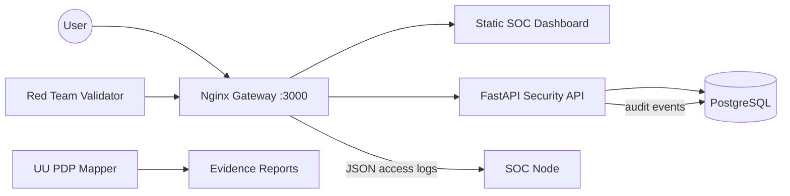

# High-Level Design - Shield-PDP

## 1. Purpose
Shield-PDP is a demo-ready cybersecurity ecosystem for a fintech-style personal-data platform. It combines a hardened customer API, a SOC dashboard, red-team validation, structured audit evidence, and UU PDP compliance mapping.

## 2. Logical Zones

### 2.1 Public / DMZ
- **Nginx Gateway**: Serves the SOC dashboard and proxies `/api/v1/vulnerable/*` to the API.
- **Dashboard UI**: Static, self-contained dashboard that calls live health, readiness, and summary APIs.

### 2.2 Application LAN
- **FastAPI Security API**: JWT access and refresh tokens, object-level authorization, RBAC, health checks, metrics, and structured audit events.
- **PostgreSQL**: Stores demo users, profiles, accounts, and audit events.

### 2.3 SOC Zone
- **SOC Node Placeholder**: Isolated node for future SIEM/log forwarding integration.
- **Detection Rules**: Sigma-style rules aligned to Nginx JSON access logs and API audit events.

### 2.4 Offensive Simulation
- **Red-Team Control Validation**: Attempts IDOR, BOLA, and admin access probes and passes only when those probes are blocked.

## 3. Data Flow
1. Browser requests the dashboard at `http://localhost:3000`.
2. Dashboard fetches `/api/v1/vulnerable/health`, `/ready`, and `/dashboard/summary` through Nginx.
3. Nginx injects `X-Request-ID` and logs JSON access events.
4. FastAPI validates JWTs, checks RBAC/object ownership, records audit events, and returns structured responses.
5. Compliance and red-team scripts generate evidence under `reports/`.

## 4. Technology Stack
- Docker Compose
- Nginx
- FastAPI, SQLAlchemy, python-jose
- PostgreSQL
- Static HTML/CSS/JavaScript dashboard
- Sigma-style detection rules

## 5. Network Diagram

