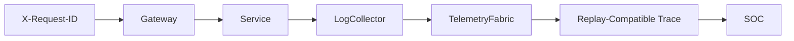

# Observability Guide

Shield-PDP observability covers structured logs, metrics, SIEM-compatible alerts, distributed traces, replay telemetry, attack correlation, and dashboards.

## Telemetry Layers

| Layer | Service / File | Purpose |
| --- | --- | --- |
| Structured logs | `log-collector` | Central event store. |
| Metrics | `/metrics` on enterprise services | Request, error, auth failure, telemetry counters. |
| SIEM bridge | `siem-bridge` | Wazuh/OpenSearch-compatible views. |
| Detection | `detection-engine` | Sigma-style rule matching and validation. |
| Correlation | `correlation-engine` | Timeline, incidents, identity abuse summaries. |
| Distributed telemetry | `telemetry-fabric` | Trace generation, service map, telemetry SLA. |
| Config templates | `observability/stage7` | OTel, Prometheus, Grafana, Loki, Tempo configuration. |

## Trace Model



## SIEM Pipeline

1. Services emit structured events.
2. Log collector stores events in memory and JSONL.
3. Detection engine normalizes events and applies rules.
4. SIEM bridge exposes Wazuh/OpenSearch-compatible output.
5. Correlation engine groups high-severity and attack-simulation alerts.

## Telemetry Validation

Use:

```bash
make stage7-validate
```

or query:

- `/telemetry-fabric/api/sla`
- `/observability/service-health`
- `/logs/events/summary`
- `/detections/api/validation/run`

## Common Blind Spots

- Service not included in active stage target list.
- Missing request ID on custom calls.
- Auth failure before downstream telemetry is emitted.
- Scenario generated too few events for detection threshold.
