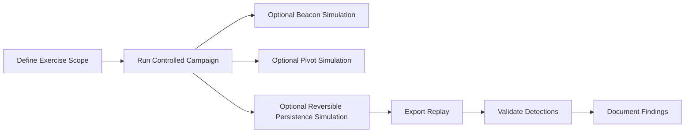

# Red Team Operator Guide

This guide explains how to operate Shield-PDP adversary simulations safely inside the isolated lab.

> Shield-PDP is not a real offensive operations framework. It provides controlled state transitions and telemetry for training, replay, and detection validation.

## Operator Roles

| Role | Lab Purpose |
| --- | --- |
| `red_team_operator` | Run controlled campaigns, beacon simulations, pivot simulations, and replay. |
| `soc_analyst` | Observe and triage generated events. |
| `detection_engineer` | Validate alert coverage and tune detections. |
| `admin` | Exercise full platform workflows. |

## Recommended Workflow

## Campaign Orchestration

Use Stage 5 or Stage 6 campaign APIs for operator-paced scenarios:

- insider threat simulation
- CI/CD compromise simulation
- token abuse campaign
- internal recon campaign
- secrets abuse campaign
- adaptive token-to-secrets campaign
- CI/CD pivot with chaos-aware timing

Campaigns emit telemetry and complete immediately as synthetic workflows. They do not execute payloads or commands.

## Beacon Simulation

Beacon simulation supports:
- callback interval
- jitter
- sleep profile
- encrypted telemetry marker
- safe task polling
- synthetic command-result profiles

Raw command fields are rejected by design.

## OPSEC Simulation Notes

OPSEC simulation is a timing and telemetry exercise. It models:
- low-and-slow operations
- business-hour blending
- route rotation
- delayed execution markers
- low-noise profiles

It must not be used to hide real activity. The platform intentionally keeps all actions observable.

## Telemetry Tagging

Operator workflows should include:
- campaign ID
- replay ID
- request ID
- operator identity
- stage tag
- MITRE mapping
- safety controls

## Attack Graph Usage

After campaign execution:

1. Generate the attack graph.
2. Review privilege paths.
3. Calculate blast radius for high-value services.
4. Share graph output with SOC analysts.
5. Use replay export for debrief.

## Exercise Closeout

- Confirm no active persistence simulations remain.
- Run relevant stage validation.
- Export timeline or replay evidence.
- Record detections triggered and missed.
- Document improvements as defensive recommendations.
