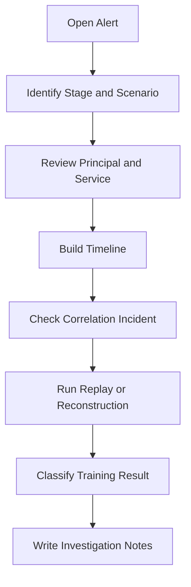

# SOC Analyst Guide

This guide describes how SOC analysts investigate Shield-PDP telemetry, detections, incidents, and replay evidence.

## SOC Objectives

- Confirm whether alerts belong to an approved lab scenario.
- Reconstruct timeline by request ID, principal, service, and detection rule.
- Identify trust-boundary crossings.
- Use replay to explain the attack chain.
- Document defensive lessons and mitigation recommendations.

## Triage Workflow

## Key SOC Routes

| Route | Purpose |
| --- | --- |
| `/detections/api/alerts` | Detection alerts. |
| `/siem/api/pipeline/status` | SIEM pipeline health and alert counts. |
| `/siem/api/wazuh/alerts` | Wazuh-compatible alert view. |
| `/correlation/api/timeline` | Event and alert timeline. |
| `/correlation/api/attack-paths` | Correlated incidents. |
| `/purple/api/incidents` | SOC dashboard incident queue. |
| `/intelligence/api/time-travel/reconstruct` | Stage 6 forensic reconstruction. |
| `/scale/api/replay/export` | Stage 7 enterprise-scale replay export. |

## Alert Prioritization

| Priority | Indicators |
| --- | --- |
| Critical | Secret broker abuse, privileged token misuse, policy drift touching service accounts. |
| High | Beacon heartbeat, pivot, persistence registration, zero-trust deny, failover simulation. |
| Medium | Recon, coverage analysis, GitOps rollout planning, telemetry SLA evaluation. |
| Low | Defensive summary, executive view generation, routine synthetic background activity. |

## Investigation Notes

Every investigation should capture:
- alert ID and rule ID
- request ID
- principal
- source service
- MITRE techniques
- replay ID or export ID
- expected training outcome
- detection gaps or tuning notes

## False Positive Handling

Most alerts are expected during approved exercises. The analysis question is not "is this malicious in production?" but "did the SOC see the expected behavior, in the expected order, with enough context to respond?"

## Closeout

1. Confirm scenario safety controls.
2. Confirm replay integrity.
3. Capture detection coverage.
4. Record mitigations.
5. Run the relevant validator.
